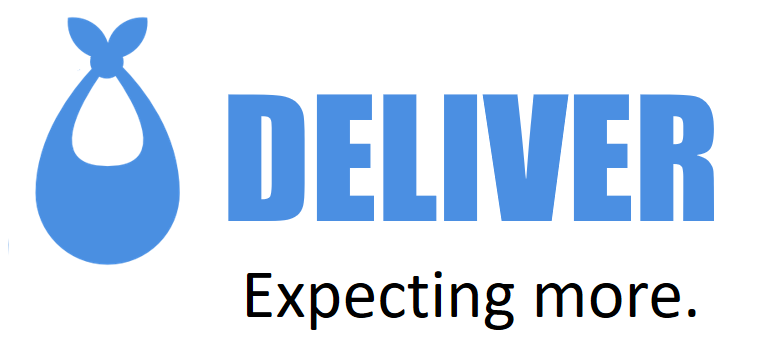

## About This Project

*Deliver* is an app that brings mothers and midwives together by facilitating discovery and communication. It was developed during the [Startupbootcamp Health Hackathon 2017](https://www.startupbootcamp.org/events/startupbootcamp-health-hackathon-2/) by [Maximilian Grundke](https://twitter.com/parnswir), [Miguel Dönicke](https://twitter.com/mrhaitec), [Venkatesh Pampana](https://twitter.com/ClassleSoft), [Alexej W.A. Gornizki](https://twitter.com/AlexGornizki), and [Lou Anfriani](https://twitter.com/LouAnfriani).

## Demo

Deliver is based on Ionic, Nodejs, and MongoDB.
If you want to run the demo on your machine, follow these steps:

1. Install the requirements: a current [Nodejs](http://nodejs.org) and a [MongoDB](http://mongodb.com) server.
2. Execute `setup.sh`

To run the backend:

1. Run `mongod` from a terminal
2. Import the development database: `mongorestore dump`
3. `cd backend && node index.js`

To run the frontend:

1. Setup your host file to point `deliver-backend` to point to `localhost` (or wherever the backend is running).
2. `cd frontend && ionic serve --lab`
